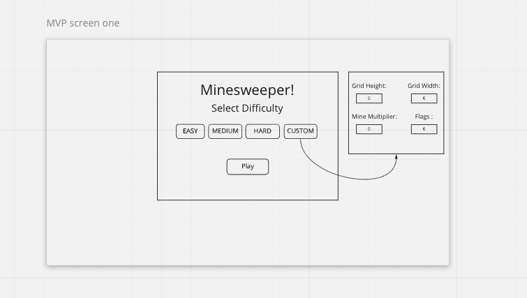
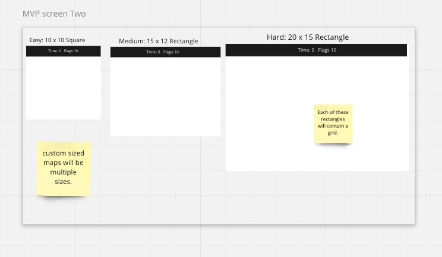
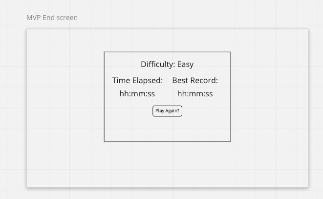

# Minesweeper Clone
This project is all about building a clone of a classic game called minesweeper. To learn more about minesweeper checkout [this link](https://en.wikipedia.org/wiki/Minesweeper_(video_game)).

## Motivation
I've always enjoyed playing video games across a number of different genres and I wanted to challenge myself to clone one without any help.
So far (Jan 2021) I have built a couple games before with some guided help like [concentration](https://josh-w42.github.io/Memory-Game/) and this [HTML5 canvas game](https://josh-w42.github.io/frontend-nanodegree-arcade-game/). However, I find the challenge minesweeper presents very interesting.

<!-- ---
### Screenshots
screen captures of your app -->

---
### User Stories & Wireframes
1. First page is rendered.
    - Player is given 4 choices for game difficulty: Easy, Medium, Hard, Custom.
2. Custom Window form is rendered. (Optional)
    - Only upon choosing custom will an additional form window appear.
    - In this form the user can select the width and height of the canvas, a modifier for the number of mines, and the number of flags.
3. Play button pressed and game is rendered.
    - Depending on difficulty selection, a grid of boxs will render on the page.
    - Additionally, a HUD will display of the number of flags available and time elapsed since the game started.
4.  Game starts when the first box is clicked.
    - When a player clicks on a box, it is revealed.
    - Boxes can reveal one of 3 different things: an empty box (not surrounded by any mines), a number within the box (refering to the number of mines surrounding it), or a mine.
5. Outcomes after a box is selected:
    - Upon selecting an empty box, all nearby empty boxes are revealed and nearby boxes containing numbers.
    - Upon selecting a numbered box, only itself is revealed.
    - Upon selecting a mine, this triggers the end of game and results in a loss.
6. If the user flags a box (Optional):
    - flagging a box insures that the box cannot be revealed unless a flag is removed.
    - flagging a box occurs when the user right clicks an unrevealed box. Similarly, a flag is removed with a right click.
7. End of game (Loss).
    - Canvas is hidden from view.
    - End of game window is rendered, displaying the time elasped, the best time the user has ever played the game resulting in a win (with respect to that difficulty), and a "play again" button.
    - User may navigate back to the starting screen with the "play again" button.
8. End of game (Win).
    - Similar to the results of loss, however, user's elasped time is recorded in local storage and is displayed on screen if it is the best time out of what is recorded locally.

### Start Screen:

### Game Screen:

### End Screen:

---
### Technologies & Code Snippets
* HTML5 / CSS3
* Javascript (ES6)
* HTML5 Canvas
* screen captures of your code

---

### Future development
I anticipate refractoring various features of this project for efficiency. Additionally, I'll be updating the User Interface over time for style.
